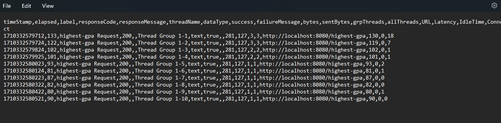

# Screenshots
Jmeter result (before refactor)

JTL result (before refactor)

Jmeter result (after refactor)

JTL result (after refactor)

Ya, terdapat perbedaan sebelum dilakukan refactor dan sesudah dilakukan refactor.
Dapat dilihat dari Jmeter result dimana keseluruhan metode cenderung memiliki sample time
yang lebih kecil setelah dilakukan refactor dibanding sebelum dilakukan refactor

# Reflection

## Module 5

1. Perbedaan antara performance testing dengan JMeter dan profiling dengan IntelliJ Profiler untuk optimasi performa aplikasi yaitu :
    * Berdasarkan tujuannya, JMeter digunakan untuk tes performa dengan cara menilai bagaimana sistem bekerja ketika diberi banyak workload.
      Sedangkan IntelliJ Profiler digunakan untuk profiling, yaitu menganalisis runtime aplikasi, konsumsi resource, dan melihat apakah akan terjadi bottleneck atau tidak
    * Berdasarkan cakupannya, JMeter berfokus pada interaksi sistem (high-level) seperti dengan HTTP request ketika sistem diberi workload yang banyak.
      Sedangkan InteliJ profiler lebih berfokus pada kode sistem dan runtime environment (low-level)
    * Berdasarkan outputnya, JMeter akan menghasilkan report dan metriks performa berdasarkan hasil tes. Sedangkan IntelliJ profiler menyediakan detail runtime dan visualisasi
      memori usage, CPU profiles, dan lainnya.
2. Profiling berguna dalam mengidentifikasi kelemahan aplikasi dengan cara :
    * Mengidentifikasi kemungkinan terjadinya bottleneck
    * Melihat kondisi CPU, memory, dan lainnya dari aplikasi saat di run
    * Mengidentifikasi memori yang digunakan, apakah terjadi leakage atau tidak
    * Mengidentifikasi aktivitas thread
3. Ya, menurut saya IntelliJ profiler efektif dalam mendeteksi terjadinya bottleneck pada sebuah program.
   Profiler akan menyediakan flame graph yang memudahkan developer untuk melihat method mana yang memiliki runtime paling lama.
   Hal tersebutlah yang sangat membantu developer dalam menemukan bottleneck
4. Merasa kesulitan dalam melakukan performance testing di Jmeter karena masih belum terlalu familiar dengan tools-tools yang ada.
   Selain itu, saya juga menghadapi banyak trial and error yang menyebabkan saya membuat banyak test plan baru.
   Pada profiling saya merasa masih kesultian membaca graphnya. Sehingga saya melakukan coba-coba sendiri
5. Main benefit menggunakan Intellij Profiler yaitu dapat menemukan bottleneck melalui analisis runtime dan CPU
6. Jika terdapat inkonsistensi antara IntelliJ profiler dengan JMeter, setelah melakukan searching di internet, dapat di-handle dengan cara :
   * Melakukan konfigurasi ulang test configuration
   * Memastikan environment seperti jaringan dan system configuration sama
7. Yang paling saya rasakan sebelum dan sesudah refactor yaitu pada Jmeter. sebelum refactor, ketika dilakukan testing, Jmeter akan menampilkan hasil sangat lama.
   Sedangkan setelah dilakukan refactor, Jmeter akan menampilkan hasil sangat cepat, hanya memerlukan beberapa detik.
   Itulah yang membuat saya yakin bahwa strategi refactor yang saya gunakan telah berhasil meningkatkan performa code dan tidak mengganggu code lain